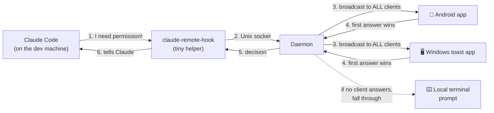
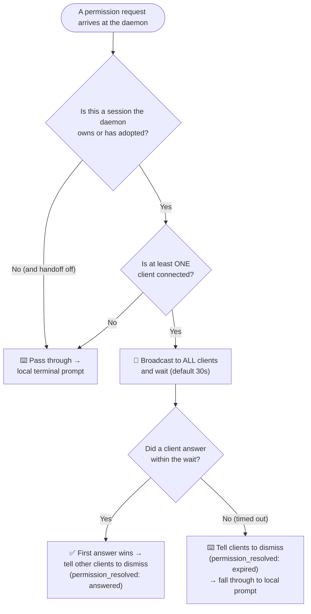

# Where do permission notifications go? (plain-English guide)

This document explains what happens when Claude Code wants permission to do
something (run a command, edit a file, fetch a URL), and how the request reaches
your **notification clients** — the Android app and/or the Windows toast app —
and falls back to the **local terminal** when no one is listening.

Key idea: the daemon is the **single hook backend**. It fans every permission
request out to **all connected clients at once**. The **first** client to answer
wins; the others are told to dismiss. If nobody answers (or nobody is
connected), the request falls through to Claude Code's own local prompt — it is
never silently approved and never left hanging.

---

## The big picture

Both clients are **WebSocket clients** of the daemon and are treated equally.
The Windows toast app used to be a separate HTTP-over-SSH-tunnel system; it is
now just another client (see `clients/windows/`).

---

## How the daemon routes a request

In words:

1. **Whose session is it?** Only sessions the daemon spawned (env var
   `CLAUDE_REMOTE_SESSION` set) or *adopted* via desktop→mobile handoff are
   handled remotely. Anything else passes straight through to the local prompt.
2. **Is anyone listening?** If **no** client is connected, the daemon does not
   broadcast into the void — it passes through immediately so the local prompt
   handles it. No 5-minute stall.
3. **Broadcast and wait.** With clients connected, the request goes to **all**
   of them and the daemon waits up to a configurable window
   (`--permission-wait`, default **30 s**).
   - **A client answers** → the first answer wins; the daemon sends every other
     client a `permission_resolved` (reason `answered`) so the stale toast/card
     disappears.
   - **No one answers in time** → the daemon sends `permission_resolved`
     (reason `expired`), then **passes through** to the local prompt. It does
     **not** auto-deny.

### Local terminal is always usable too

While the daemon waits, Claude Code's own terminal prompt is also shown, so you
can simply answer at the keyboard — Claude proceeds immediately. The daemon
cannot *detect* a local answer (hooks do not report the interactive prompt's
outcome), so it will not auto-dismiss the remote toast in that case; dismiss it
manually, or it clears when the wait expires.

---

## What if a client dies mid-wait?

The daemon keeps an active **heartbeat**: the WebSocket library pings each client
every 20 s and drops one that stops responding, and any failed send prunes the
client immediately. A dead client is therefore removed from the "connected" set,
so it neither receives broadcasts nor counts toward "is anyone listening?".

---

## Failure behaviour at a glance

| Situation | What happens |
| --- | --- |
| Daemon is **down** | The hook helper approves immediately ("fails open") — Claude is never bricked. |
| Daemon up, **no client connected** | Pass through to the local terminal prompt at once. |
| Daemon up, clients connected, one answers | The **first** answer wins; other clients dismiss. |
| Daemon up, clients connected, **none answers in 30 s** | Clients told to dismiss; fall through to the local prompt (not auto-denied). |
| You answer at the **local terminal** | Claude proceeds; remote toasts linger until dismissed/expired. |

Informational notifications ("Claude finished its turn", etc.) are one-way and
best-effort: if a client is not connected they are simply dropped, with no delay.

---

## Related reading

- `protocol/messages.md` — the exact messages (`permission_request`,
  `permission_response`, `permission_resolved`, `notification`, `set_handoff`, …).
- `daemon/claude_remote_daemon/hooks.py` — routing (`_route`) and the wait /
  fallback logic (`_handle_permission`, `resolve`).
- `clients/windows/README.md` — the Windows toast WebSocket client.
- `CLAUDE.md` → "Desktop→mobile handoff" — the adopted-session design.
